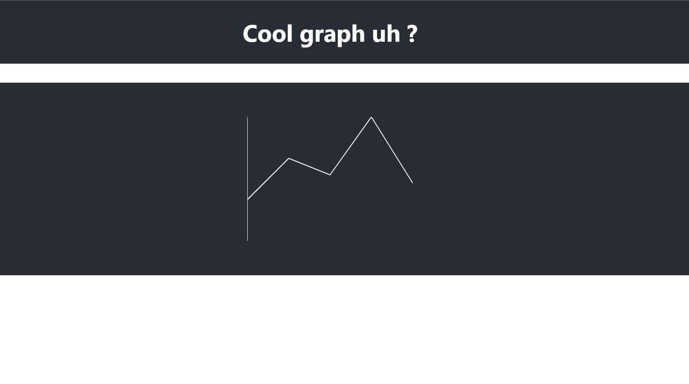
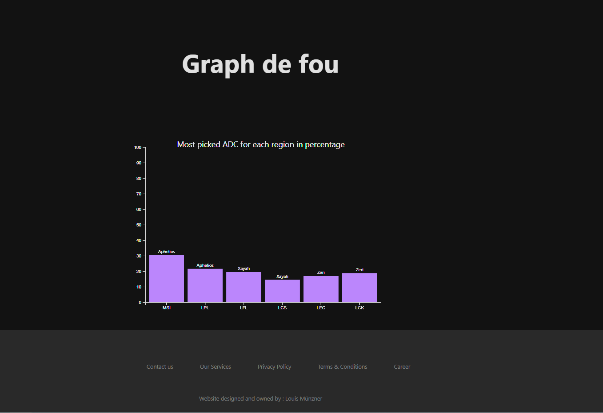

# web-dashboard

This repository documents my journey in learning and building an interactive dashboard using React and D3. The project utilizes PostgreSQL as the database and Express.js to handle the API, bridging the gap between PostgreSQL and the frontend.


## Development Milestones

### 01/09 - Display of a D3 graph

After setting up the React project and installing the necessary dependencies, I delved into the React environment to gain a deeper understanding. Here's a snapshot of what the website looked like after my initial commit:

The primary aim was to build familiarity and confidence in utilizing these previously unexplored tools. It's worth noting that the graph presented here does not rely on authentic data, it's simply for illustrative purposes.




### 02/09 - API endpoint set up

To create graphs based on real data, I chose to use data from an API endpoint I set up. While I could have loaded the data from a CSV file, this approach would have imposed a significant processing burden on the frontend and raised security concerns. To create this API endpoint, I utilized Express.js to execute a SQL query to PostgreSQL and then converted the retrieved data into JSON format. The data is sent to a different server, which still resides on localhost but uses a different port, specifically at http://localhost:5000/api/data.

```
[{"league":"MSI","champion_picked":"Aphelios","occurrence_percentage":"30.26"},{"league":"LPL","champion_picked":"Aphelios","occurrence_percentage":"21.46"},
{"league":"LFL","champion_picked":"Xayah","occurrence_percentage":"19.42"},{"league":"LCS","champion_picked":"Xayah","occurrence_percentage":"14.39"},
{"league":"LEC","champion_picked":"Zeri","occurrence_percentage":"16.85"},{"league":"LCK","champion_picked":"Zeri","occurrence_percentage":"18.69"}]
```

### 03/09 - Fetch data from the endpoint to the App.js 

#### Data Fetching

In my quest to harness the power of data visualization, I've encountered the need to navigate the intricacies of data manipulation from SQL queries. Since manipulating data directly from SQL queries can be challenging, we're exploring a multi-layered approach to streamline the process and achieve my goal of producing high-complexity graphs.

For reference, this is the query used to display the graph you can see below : 
```SQL
WITH ChampionOccurrences AS (
    SELECT league, champion_picked, COUNT(champion_picked) AS occurrence
    FROM public.pro_player
    WHERE role_position LIKE 'bot'
        AND league IN ('LFL', 'LCK', 'LCS', 'LPL', 'LEC', 'MSI', 'WLDS')
    GROUP BY league, champion_picked
),
LeagueTotalOccurrences AS (
    SELECT league, SUM(occurrence) AS total_occurrence
    FROM ChampionOccurrences
    GROUP BY league
),
RankedChampions AS (
    SELECT co.league, co.champion_picked, ROW_NUMBER() OVER (PARTITION BY co.league ORDER BY co.occurrence DESC) AS rn
    FROM ChampionOccurrences co
)
SELECT rc.league, rc.champion_picked, ROUND((co.occurrence::decimal / lt.total_occurrence) * 100, 2) AS occurrence_percentage
FROM RankedChampions rc
JOIN LeagueTotalOccurrences lt ON rc.league = lt.league
JOIN ChampionOccurrences co ON rc.league = co.league AND rc.champion_picked = co.champion_picked
WHERE rc.rn = 1;
```

***Raw SQL Queries***: To simplify data extraction, we're considering sending raw SQL queries to the database. This approach allows us to leverage the database's processing capabilities and retrieve precisely the data we need.

***Python Scripting***: To bridge the gap between raw SQL data and our Express.js application, we might incorporate Python scripting. The scripting process involves fetching the data from the database, processing it, and preparing it for integration with our Express.js application.

***API.js Integration***: Once the data has been refined and prepared using Python, we seamlessly integrate it into our Express.js application through the API.js file. This final step ensures that the data is readily available for generating high-complexity graphs and visualizations.

